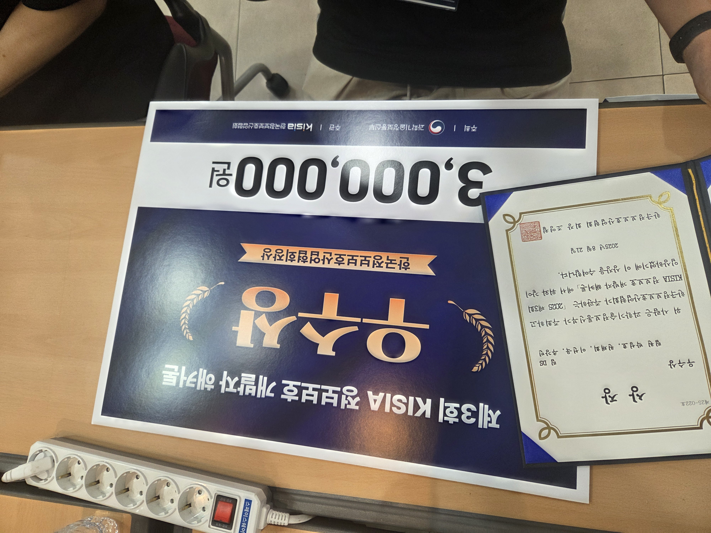

<!--타이틀 부분-->

  
  
  <!-- Typing SVG -->
  

<!--내용 부분-->
<h3 align="center">✨ Tech Stack ✨</h3>

  &nbsp
  &nbsp
  &nbsp
  &nbsp

 

  &nbsp
  &nbsp
  &nbsp
  &nbsp

<h3 align="center">📚 Studying 📚</h3>

  &nbsp
  &nbsp
  &nbsp
  &nbsp

  &nbsp
  &nbsp

 

<h3 align="center">💼 Career 💼</h3>

  
| 기간 | 내용 | 비고 |
|:---:|:---:|:---:|
| 2025.7.04 | NAVER CLOUD PLATFORM AI Hands-on Lab | 🤖 |
| 2025.7.7 ~ 2026.7.10 |  제7기 미국알기 아카데미  | 🇺🇸 |
| 2025.7 ~ 2026.12 | 2025년 개인정보 불법유통 대응 대학생 모니터링단 | 🔐 |
| 2025.07 ~ 2025.12 | KISIA AI 보안기술개발 | 🔐 |
| 2025.9.20 | 2025년 KISA 웹테크 밋업데이 : Flutter로 모바일 앱 개발 | 💻 |
| 2025.11.03 ~ 2025.11.08 | 일본 해외연수 | 🇯🇵 |
| 2025.12.22 ~ 2026.01.09 | 푸단대 겨울캠프 FIWS | 🇨🇳 |

 

<h3 align="center">🏆 Awards 🏆</h3>

  
  
| 날짜 | 대회/행사 | 수상 내역 | 주최 |
|:---:|:---:|:---:|:---:|
| 2025.08.21 | 제3회 KISIA 정보보호 개발자 해커톤 | 우수상 | 과기부 |

 

<h3 align="center">💻 Projects 💻</h3>

  
### 🚀 진행 중인 프로젝트
  
| 프로젝트명 | 역할 | 기간 |
|:---:|:---:|:---:|
| [AI SSL DLP](https://github.com/AITLS-DLP) (kisia ai보안교육과정 개인정보반) | Tech Lead | 2025.07 ~ 진행중 |
| 공급망 사이버 보안 위험 평가 ai 에이전트 | 총괄 팀장 | 2025.09 ~ 진행중 |
| 딥러닝을 활용한 사진화질 개선 서비스 | 개발팀원 | 2025.09 ~ 진행중 |

 

<h3 align="center">📜 Certifications 📜</h3>

  
| 자격증명 | 등급/레벨 | 발급기관 |
|:---:|:---:|:---:|
| AICE | Basic | KT |
|정보보호능력검정 | 2급 | TOLIS |
| AIDE 자격검정시험 | 2급 | 한국인공지능자격센터 |
| Azure AI-900 | - | Microsoft |

 

<h3 align="center">🛠 Tools 🛠</h3>

  &nbsp
  &nbsp
  &nbsp

  &nbsp
  &nbsp

 

  &nbsp
  &nbsp

 

<h3 align="center">📊 GitHub Stats 📊</h3>

<!-- GitHub Streak Stats -->

  

<!-- GitHub Stats Cards -->

&nbsp;&nbsp;

  

<h3 align="center">📫 Contact 📫</h3>

  <a href="mailto:psh243360@gmail.com">
    &nbsp
  </a>
  <a href="https://huggingface.co/psh3333">
    &nbsp
  </a>

<!-- Footer Wave -->

  

