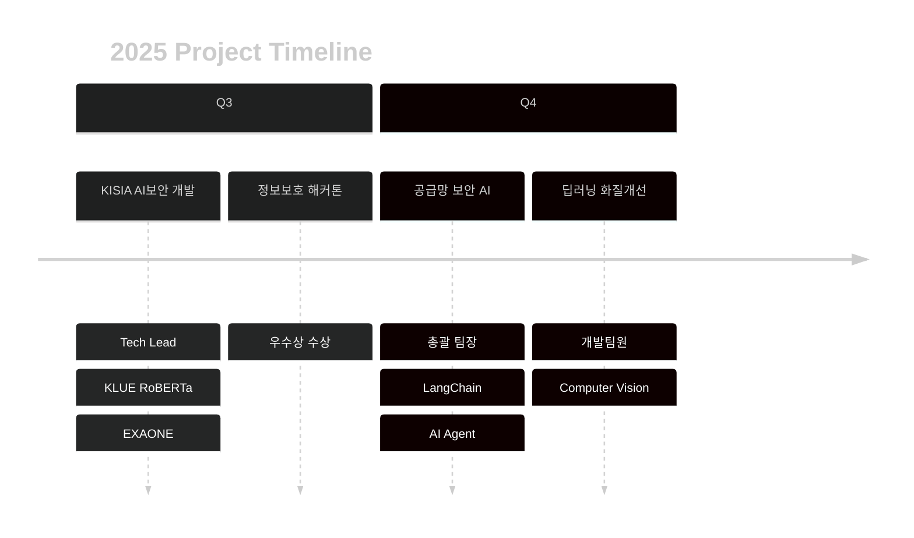

 
 

<!-- 메인 타이핑 애니메이션 -->

 

<!-- 성과 하이라이트 -->

## 🎯 2025 HIGHLIGHTS

<table align="center">
<tr>
<td align="center" width="25%">

 
<b>최우수상</b>
 
KISIA AI보안
</td>
<td align="center" width="25%">

 
<b>우수상</b>
 
정보보호 해커톤
</td>
<td align="center" width="25%">

 
<b>93.30% F1</b>
 
Korean PII Detection
</td>
<td align="center" width="25%">

 
<b>Tech Lead</b>
 
KISIA Project
</td>
</tr>
</table>

 

---

 

<!-- 핵심 프로젝트 -->

## 💼 CORE PROJECTS

 

### 🔐 AI SSL DLP System
**한국어 개인정보 탐지 시스템**

**3-Stage Pipeline** → Preprocessing → Entity Recognition → Validation

 

---

 

<!-- 기술 스택 -->

## ⚡ TECH ARSENAL

 
 

 

---

 

<!-- GitHub Stats -->

## 📊 GITHUB METRICS

 

 

---

 

<!-- 활동 내역 -->

## 🎓 EDUCATION & ACTIVITIES

<table align="center">
<tr>
<td width="50%">

### 🏛️ Korea University
**AI Cybersecurity Major**
- Transfer Student (2024.03 ~)
- GPA Focus: Deep Learning, RL
- K-Shield Junior Program

</td>
<td width="50%">

### 🔬 Research Interests
- **Personal Information Protection**
- **NLP Security & Detection**
- **AI Agent Development**
- **Supply Chain Security**

</td>
</tr>
</table>

 

### 📜 Certifications

 

---

 

<!-- 연락처 -->

## 📬 CONNECT

 
 

 

---

 

### 💡 Philosophy

**"Building secure AI systems through innovative technology"**

*Specializing in Korean NLP Security & AI-powered threat detection*

 

