<!-- 
=====================================================================
  🔥 CREATINE-MONO'S EPIC GITHUB PROFILE 🔥
  AI Security Developer | Korea University | Deep Learning Researcher
=====================================================================
-->

<!-- 메인 헤더 애니메이션 -->

 

<!-- 다이나믹 타이핑 효과 -->

 

<!-- 프로필 뷰 카운터 -->

 
 

<!-- 구분선 -->

 

<!-- ============================================= -->
<!-- 2025 하이라이트 섹션 -->
<!-- ============================================= -->

## 🎯 2025 HIGHLIGHTS

<table>
<tr>
<td align="center" width="25%">

 
 
<b>🏆 최우수상</b>
 
KISIA AI보안
 
과학기술정보통신부
</td>
<td align="center" width="25%">

 
 
<b>🥈 우수상</b>
 
정보보호 개발자 해커톤
 
한국정보보호산업협회
</td>
<td align="center" width="25%">

 
 
<b>🎯 93.30% F1</b>
 
Korean PII Detection
 
KLUE RoBERTa Model
</td>
<td align="center" width="25%">

 
 
<b>👨‍💻 Tech Lead</b>
 
KISIA AI 보안기술개발
 
2025.07 - 2025.11
</td>
</tr>
</table>

 

 

<!-- ============================================= -->
<!-- 핵심 프로젝트 섹션 -->
<!-- ============================================= -->

## 💼 CORE PROJECTS

 

### 🔐 AI SSL DLP System
**한국어 개인정보 탐지 및 보호 시스템**

 

```mermaid
%%{init: {'theme':'dark', 'themeVariables': { 'primaryColor':'#667eea','primaryTextColor':'#fff','primaryBorderColor':'#764ba2','lineColor':'#f093fb','secondaryColor':'#764ba2','tertiaryColor':'#667eea'}}}%%
graph LR
    A[Input Text] -->|전처리| B[Preprocessing]
    B -->|분석| C[KLUE RoBERTa]
    C -->|추출| D[Entity Recognition]
    D -->|검증| E[EXAONE Validation]
    E -->|결과| F[PII Detection 93.30%]
    
    style A fill:#667eea,stroke:#764ba2,stroke-width:3px,color:#fff
    style F fill:#f093fb,stroke:#764ba2,stroke-width:3px,color:#fff
```

### 🛡️ Supply Chain Risk AI Agent
**공급망 사이버 보안 위험 평가 시스템**

 

 

<!-- ============================================= -->
<!-- 기술 스택 섹션 -->
<!-- ============================================= -->

## ⚡ TECH STACK

### 🤖 AI & Deep Learning

 

 

### 🌐 Web Development

 

 

### 🔧 Tools & Platforms

 

 

 

<!-- ============================================= -->
<!-- GitHub 통계 섹션 -->
<!-- ============================================= -->

## 📊 GITHUB ANALYTICS

 
 

<!-- GitHub Stats Cards -->

 
 

<!-- GitHub Streak -->

 
 

<!-- Activity Graph -->

 
 

<!-- 백준 프로필 -->

 

 

<!-- ============================================= -->
<!-- 교육 및 자격증 섹션 -->
<!-- ============================================= -->

## 🎓 EDUCATION & CERTIFICATIONS

 

<table align="center">
<tr>
<td width="50%" align="center">

### 🏛️ Korea University
**AI Cybersecurity Major**

- Transfer Student (2024.03~)
- AICE Associate Certified
- K-Shield Junior Program

 

### 🔬 Research Focus
- Personal Information Protection
- NLP Security & Detection  
- AI Agent Development
- Supply Chain Security

</td>
<td width="50%" align="center">

### 📜 Certifications

 
 

### 🏆 Career Timeline

| 기간 | 활동 |
|:---:|:---|
| **2025.07~12** | KISIA AI 보안기술개발 |
| **2025.07~26** | 제7기 미국알기 아카데미 |
| **2025.07~12** | 개인정보 불법유통 모니터링단 |
| **2025.11** | 일본 해외연수 🇯🇵 |

</td>
</tr>
</table>

 

 

<!-- ============================================= -->
<!-- 연락처 섹션 -->
<!-- ============================================= -->

## 📬 CONNECT WITH ME

 
 

 
 

 

<!-- ============================================= -->
<!-- 푸터 섹션 -->
<!-- ============================================= -->

 

### 💡 Development Philosophy

**"Building secure AI systems through innovative technology"**

*Specializing in Korean NLP Security & AI-powered threat detection*

 

 
 

<!-- Snake Animation -->
<picture>
  <source media="(prefers-color-scheme: dark)" srcset="https://raw.githubusercontent.com/Creatine-mono/Creatine-mono/output/github-contribution-grid-snake-dark.svg">
  <source media="(prefers-color-scheme: light)" srcset="https://raw.githubusercontent.com/Creatine-mono/Creatine-mono/output/github-contribution-grid-snake.svg">
  
</picture>

 
 

<!-- 
=====================================================================
  Made with 💜 by Creatine-mono
  Last Updated: December 2025
=====================================================================
-->
