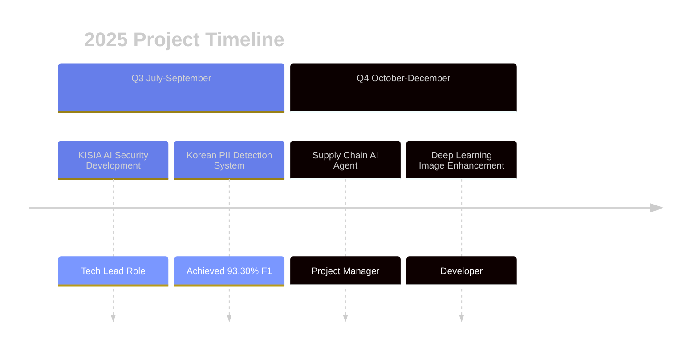

<!-- Language Selection -->
<table>
<tr>
<td>

</td>
<td>

</td>
</tr>
</table>

 

<!-- Main Header -->

 

<!-- Typing Animation -->

 

<!-- Spotify Now Playing -->

 
 

 

 

<!-- ============================================= -->
<!-- GitHub Trophy -->
<!-- ============================================= -->

## 🏆 GITHUB TROPHIES

 

 

<!-- ============================================= -->
<!-- 2025 Highlights Section -->
<!-- ============================================= -->

## 🎯 2025 HIGHLIGHTS

<table>
<tr>
<td align="center" width="50%">

 
 
<b>🎯 93.30% F1 Score</b>
 
Korean PII Detection
 
KLUE RoBERTa Model
</td>
<td align="center" width="50%">

 
 
<b>👨‍💻 Tech Lead</b>
 
KISIA AI Security Project
 
2025.07 - 2025.11
</td>
</tr>
</table>

 

 

<!-- ============================================= -->
<!-- Core Projects Section -->
<!-- ============================================= -->

## 💼 CORE PROJECTS

 

### 🔐 AI SSL DLP System
**Korean Personal Information Detection & Protection System**

```mermaid
%%{init: {'theme':'dark', 'themeVariables': { 'primaryColor':'#667eea','primaryTextColor':'#fff','primaryBorderColor':'#764ba2','lineColor':'#f093fb','secondaryColor':'#764ba2','tertiaryColor':'#667eea'}}}%%
graph LR
    A[Input Text] -->|Preprocessing| B[Data Cleaning]
    B -->|Analysis| C[KLUE RoBERTa]
    C -->|Extraction| D[Entity Recognition]
    D -->|Validation| E[EXAONE Verification]
    E -->|Result| F[PII Detection 93.30%]
    
    style A fill:#667eea,stroke:#764ba2,stroke-width:3px,color:#fff
    style F fill:#f093fb,stroke:#764ba2,stroke-width:3px,color:#fff
```

 

### 🛡️ Supply Chain Risk AI Agent
**Cybersecurity Risk Assessment System**

 

 

<!-- ============================================= -->
<!-- Tech Stack Section -->
<!-- ============================================= -->

## ⚡ TECH STACK

 

### 🐍 Python Ecosystem

 
 

### 🤖 Machine Learning & Deep Learning

 

### 🦙 LLM & NLP

 

### 📊 Data Science

 

### 🔧 Tools & Platforms

 

 

<!-- ============================================= -->
<!-- Wakatime Stats -->
<!-- ============================================= -->

## ⏰ CODING ACTIVITY

 

 

<!-- ============================================= -->
<!-- GitHub Analytics Section -->
<!-- ============================================= -->

## 📊 GITHUB ANALYTICS

 
 

<!-- GitHub Stats Cards -->

 
 

<!-- GitHub Streak -->

 
 

<!-- Activity Graph -->

 
 

<!-- Snake Animation -->
<picture>
  <source media="(prefers-color-scheme: dark)" srcset="https://raw.githubusercontent.com/Creatine-mono/Creatine-mono/output/github-contribution-grid-snake-dark.svg">
  <source media="(prefers-color-scheme: light)" srcset="https://raw.githubusercontent.com/Creatine-mono/Creatine-mono/output/github-contribution-grid-snake.svg">
  
</picture>

 
 

<!-- BOJ Profile -->

 

 

<!-- ============================================= -->
<!-- Education & Certifications Section -->
<!-- ============================================= -->

## 🎓 EDUCATION & CERTIFICATIONS

 

<table align="center">
<tr>
<td width="50%" align="center">

### 🏛️ Korea University
**AI Cybersecurity Major**

- Transfer Student (2024.03~)
- AICE Associate Certified
- K-Shield Junior Program

 

### 🔬 Research Interests
- Personal Information Protection
- NLP Security & Detection
- AI Agent Development
- LLM Applications

</td>
<td width="50%" align="center">

### 📜 Certifications

 
 

### 🏆 Activities

| Period | Activity |
|:---:|:---|
| **2025.07~12** | KISIA AI Security Development |
| **2025.07~26** | US Studies Academy 7th |
| **2025.07~12** | Privacy Monitoring Team |
| **2025.11** | Japan Overseas Training 🇯🇵 |

</td>
</tr>
</table>

 

 

<!-- ============================================= -->
<!-- Awards Section -->
<!-- ============================================= -->

## 🏆 AWARDS

 

| Date | Competition/Event | Award | Host |
|:---:|:---|:---:|:---:|
| **2025.12.19** | KISIA AI Security PII Team | 🥇 Excellence Award | MSIT |
| **2025.08.21** | 3rd InfoSec Developer Hackathon | 🥈 Merit Award | MSIT |

 

 

<!-- ============================================= -->
<!-- Contact Section -->
<!-- ============================================= -->

## 📬 CONNECT WITH ME

 
 

 
 

 

<!-- ============================================= -->
<!-- Footer Section -->
<!-- ============================================= -->

 

### 💡 Development Philosophy

**"Building secure AI systems through Python-powered innovation"**

*Specializing in Korean NLP Security & LLM Applications*

 

 
 

